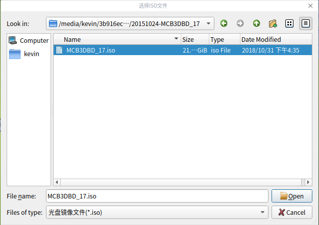
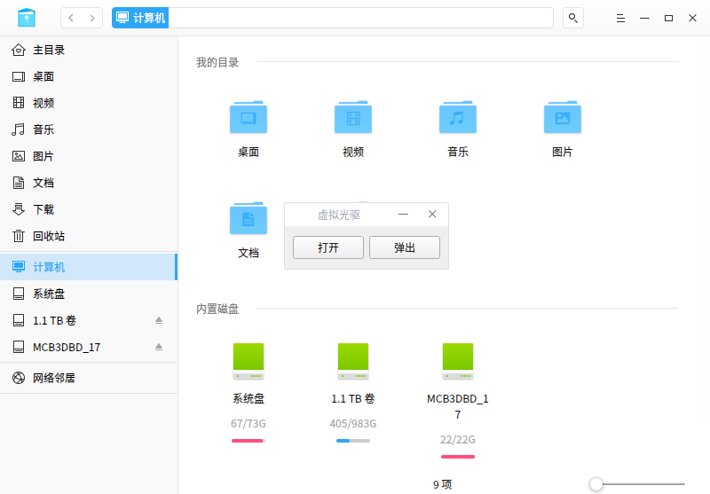
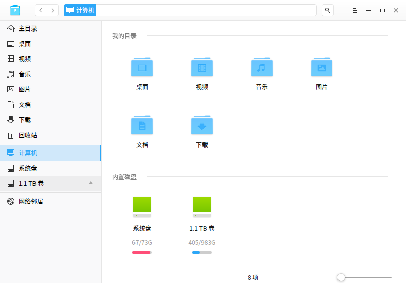

# vcd
<<<<<<< HEAD
mount ISO image file
 
一个为深度系统(deepin)用户挂载ISO镜像文件的工具
 
 
虽然deepin下可以用命令行直接挂接ISO镜像文件，相当于WINDOWS下的虚拟光驱，但一般使用者习惯于使用图形化界面进行操作。为方便这类用户特意做了个小工具，为用户进行ISO镜像文件挂接操作。 
 
安装包下载地址：https://pan.baidu.com/s/1CPfbmQBZIkppvk81VJwtqw 
 
安装后可以在“系统工具”中找到“虚拟光驱”，点击运行后会在屏幕中间出现 

 
单击“打开”开始ISO镜像文件选择 

 
 
单击“open&quot;原来的界面中“弹出”会有效 

 
 
再打开“深度文件管理器”会发现多了个以ISO文件名为卷标的盘 

 
 
点“弹出”后原来新增加的盘就会消失，注意要弹出前不能还在该盘里操作 

=======
A tool of mount ISO image file for Deepin OS user
一个为深度系统(deepin)用户挂载ISO镜像文件的工具
虽然deepin下可以用命令行直接挂接ISO镜像文件，相当于WINDOWS下的虚拟光驱，但一般使用者习惯于使用图形化界面进行操作。为方便这类用户特意做了个小工具，为用户进行ISO镜像文件挂接操作。

安装包下载地址：https://pan.baidu.com/s/1CPfbmQBZIkppvk81VJwtqw

安装后可以在“系统工具”中找到“虚拟光驱”，点击运行后会在屏幕中间出现
  

单击“打开”开始ISO镜像文件选择
  

单击“open"原来的界面中“弹出”会有效
  

再打开“深度文件管理器”会发现多了个以ISO文件名为卷标的盘
  

点“弹出”后原来新增加的盘就会消失，注意要弹出前不能还在该盘里操作
 
>>>>>>> cf35057956b6c3fcc04a68402a1fe98f1cd59f71
